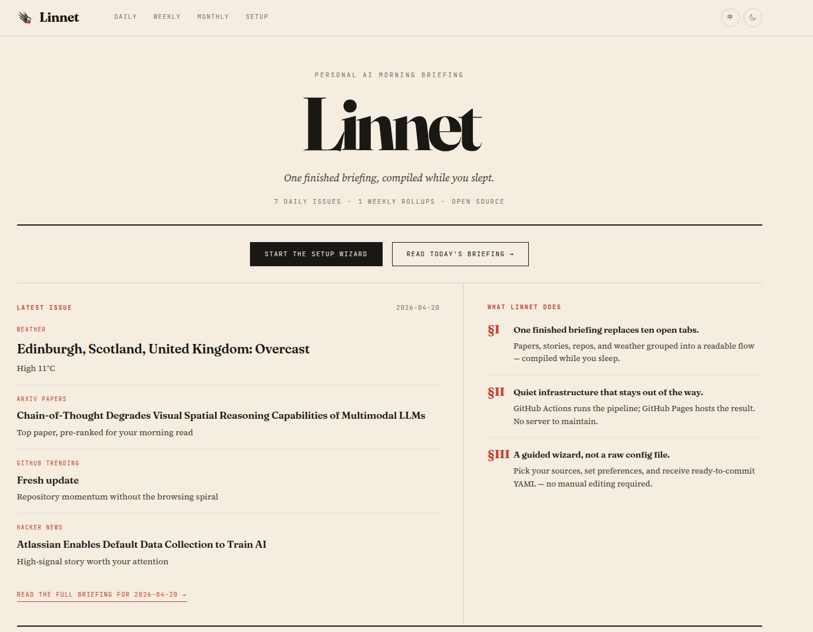

# Linnet

[](LICENSE)
[](https://github.com/YuyangXueEd/linnet/actions/workflows/daily.yml)
[](https://www.python.org/downloads/)
[](https://github.com/YuyangXueEd/linnet/pulls)

[中文](README_zh.md)

**Your personal AI morning briefing.** arXiv papers, Hacker News stories, GitHub trends, weather, and optional extras are collected overnight, summarised for you, and published as your own searchable digest site.


After you create your own repo from this template, start with the setup wizard. It is now the main sign-in, GitHub authorization, and deployment entry point: choose the briefing shape you want, add your LLM key, and let Linnet prepare the repo handoff. The current self-hosted path uses GitHub Actions and Pages behind the scenes; you do not need to run a server or accept dashboard lock-in.

**[Live example](https://yuyangxueed.github.io/linnet_new/)** · **[Start setup in English](https://yuyangxueed.github.io/Linnet/setup/)** · **[用中文进入设置向导](https://yuyangxueed.github.io/Linnet/setup/zh/)** · **[Manual config guide](dev_docs/manual-config.md)**

> **Start here after creating your repo**
> The setup page is now the main sign-in, GitHub authorization, and deployment flow for new users.
>
> English UI: <https://yuyangxueed.github.io/Linnet/setup/>
>
> 中文界面: <https://yuyangxueed.github.io/Linnet/setup/zh/>
>
> After the first deploy, add your GitHub Pages URL to the repo's **About -> Website** field so the site entrance is visible from the repo header.

---

## How it works


Linnet acts like a small AI secretary for your morning routine. It checks the sources you care about, filters the noise with an LLM, and leaves you with a polished briefing before the workday starts.

---

## See the product first

### Desktop Dashboard


### Daily Editorial Feed


---

## What you get every morning

| Source | What it gives you |
|---|---|
| **arXiv** | New papers matching your keywords, with AI summaries |
| **Hacker News** | High-signal AI/ML stories above your score threshold |
| **GitHub Trending** | Trending repos in your area |
| **Weather** | Today's forecast for your city |

Optional sources such as postdoc jobs and supervisor-page monitoring live behind the extension system, but most users do not need them on day one.

The setup wizard also exposes language-specific tagline extensions:

- `hitokoto` for Chinese briefings, no key required
- `quote_of_day` for English briefings, requires `API_NINJAS_KEY`

Linnet keeps the generated daily, weekly, and monthly archives in your published site, so the briefing stays searchable instead of disappearing into another feed.

---

## Fastest path to your own briefing

### 1. Create your own repo from this template

Use **Use this template → Create a new repository** on GitHub.

If you are just setting up your own briefing site, prefer **Use this template** over **Fork**. Forks still work, but they are more likely to hit extra GitHub friction around Actions and setup.

### 2. Install the Linnet Bridge GitHub App on that repo

Open the repo you just created, then install the **Linnet Bridge** GitHub App to that target repository.

This is the lower-friction path. It lets Linnet write files, GitHub Actions secrets, workflow settings, and GitHub Pages config for you without asking you to mint a PAT.

### 3. Open the setup wizard first

This is the main sign-in, authorization, and deployment entry point after you create your repo:

- English UI: [https://yuyangxueed.github.io/Linnet/setup/](https://yuyangxueed.github.io/Linnet/setup/)
- Chinese UI: [https://yuyangxueed.github.io/Linnet/setup/zh/](https://yuyangxueed.github.io/Linnet/setup/zh/)

You no longer need to deploy your own copy of `/setup/` first just to get started.

### 4. Fill the wizard, authorize GitHub, and deploy

At the top of the wizard:

- click **Install GitHub App** if you have not already installed it
- click **Authorize GitHub** so this browser can finish the setup flow

Then continue through the normal steps:

- briefing mode, source selection, and source detail tuning in Steps 1-2
- optional extra secrets and delivery channels in Step 3
- LLM provider, API key, model choices, and theme controls in Step 4

In Step 5, choose your target repository and click **Deploy to GitHub**.

The default one-click path uses the Linnet Bridge GitHub App flow, not a PAT. Behind the scenes, a successful deploy will:

- write the generated config files in a single commit
- create or update the needed GitHub Actions secrets
- enable `daily.yml`, `weekly.yml`, `monthly.yml`, and `pages.yml`
- configure GitHub Pages for workflow-based publishing
- trigger the first `Daily Digest` run

### 5. Run the first workflow

Most users should not need to click anything else after Step 5. Watch these two workflows in your repo:

- **Daily Digest** — generates the first issue and commits the published data
- **Deploy Astro Site to GitHub Pages** — builds the site and publishes it

Your site should go live at `https://<your-username>.github.io/<repo-name>/` a few minutes later.

Once that URL is live, put it in the repository's **About -> Website** field. That makes the site entrance easy to find directly from the GitHub repo header.

GitHub Pages provisioning can lag slightly behind the API call on a brand-new repo, so give it a short moment before assuming it failed. If repo or org policy blocks app installation, Actions, or Pages, fall back to the [manual config guide](dev_docs/manual-config.md).

---

## Config mental model

The repo stays simple if you remember four things:

1. `enabled: true/false` turns each source or sink on and off.
2. `display_order` controls the section order in the final digest.
3. `llm.provider`, `llm.base_url`, `llm.api_key_env`, and the two model IDs define how LLM calls are made.
4. Detailed per-source settings live in `config/extensions/<name>.yaml`.

Minimal example:

```yaml
display_order:
  - weather
  - arxiv
  - github_trending
  - hacker_news

weather:
  enabled: true

arxiv:
  enabled: true

github_trending:
  enabled: true

hacker_news:
  enabled: true

language: "en"

llm:
  provider: "openrouter"
  scoring_model: "google/gemini-2.5-flash-lite-preview-09-2025"
  summarization_model: "google/gemini-2.5-flash-lite-preview-09-2025"
  base_url: "https://openrouter.ai/api/v1"
  api_key_env: "OPENROUTER_API_KEY"
```

If you want to hand-edit everything, start from [`dev_docs/manual-config.md`](dev_docs/manual-config.md).

---

## Advanced paths

### Extensions

- Built-in source plugins live in [`extensions/`](extensions/)
- Shared conventions live in [`extensions/README.md`](extensions/README.md)
- New extensions can start from [`extensions/_template/`](extensions/_template/)

### Sinks

- The website is the default output
- Optional delivery channels live in [`sinks/`](sinks/)
- Shared sink conventions live in [`sinks/README.md`](sinks/README.md)
- Secrets stay in GitHub Secrets or environment variables, not committed YAML

Example:

```yaml
sinks:
  slack:
    enabled: true
    max_papers: 5
    max_hn: 3
    max_github: 3
```

### Schedules and timezones

- [`.github/workflows/daily.yml`](.github/workflows/daily.yml)
- [`.github/workflows/weekly.yml`](.github/workflows/weekly.yml)
- [`.github/workflows/monthly.yml`](.github/workflows/monthly.yml)

GitHub Actions cron uses UTC. Edit those cron lines directly in your repo if you want different times.

---

## Run locally

```bash
python -m venv .venv && source .venv/bin/activate
pip install -r requirements.txt

export OPENROUTER_API_KEY=sk-or-...   # or another env name that matches llm.api_key_env
python main.py --mode daily
python main.py --dry-run
python main.py --mode weekly
python main.py --mode monthly
```

Run tests:

```bash
PYTHONPATH=. pytest tests/ -q
```

---

## Contributing or using AI agents

This repo is friendly to both human contributors and AI coding agents.

If you are modifying repo code or docs, start with:

- [`llms.txt`](llms.txt)
- [`extensions/llms.txt`](extensions/llms.txt)
- [`sinks/llms.txt`](sinks/llms.txt)
- [`skills/linnet-contributor/SKILL.md`](skills/linnet-contributor/SKILL.md)

If you are mostly helping someone configure their own repo or digest site, start with:

- [`dev_docs/manual-config.md`](dev_docs/manual-config.md)
- [`skills/linnet-config-customization/SKILL.md`](skills/linnet-config-customization/SKILL.md)

Suggested prompt for agents:

```text
Please read llms.txt, extensions/llms.txt, sinks/llms.txt, and the relevant SKILL.md under skills/ before making changes or suggesting configuration edits.
```

---

## Share setups and ask for help

If you build an interesting setup, please share it in [Discussions](https://github.com/YuyangXueEd/linnet/discussions).

For implementation problems, config help, extension ideas, or sink requests, use the repo's issue templates.

---

## Support the project

If this repo saves you time, helps you track your field, or gives you a strong starting point for your own briefing workflow, you can support it here:

- [GitHub Sponsors](https://github.com/sponsors/yuyangxueed)
- [Ko-fi](https://ko-fi.com/guesswhat_moe)

Support is optional. Contributions, fixes, ideas, and new integrations are just as valuable.

---

## Acknowledgements

The public site is built with [Astro](https://astro.build/), which makes the GitHub Pages flow pleasantly simple.

This project also benefited from many open-source repositories, maintainers, and examples. If you notice a project that should be credited more explicitly, open an issue or PR and I will gladly add it.

[](https://star-history.com/#YuyangXueEd/linnet&Date)

---

## License

MIT — see [LICENSE](LICENSE). Contributions welcome.
